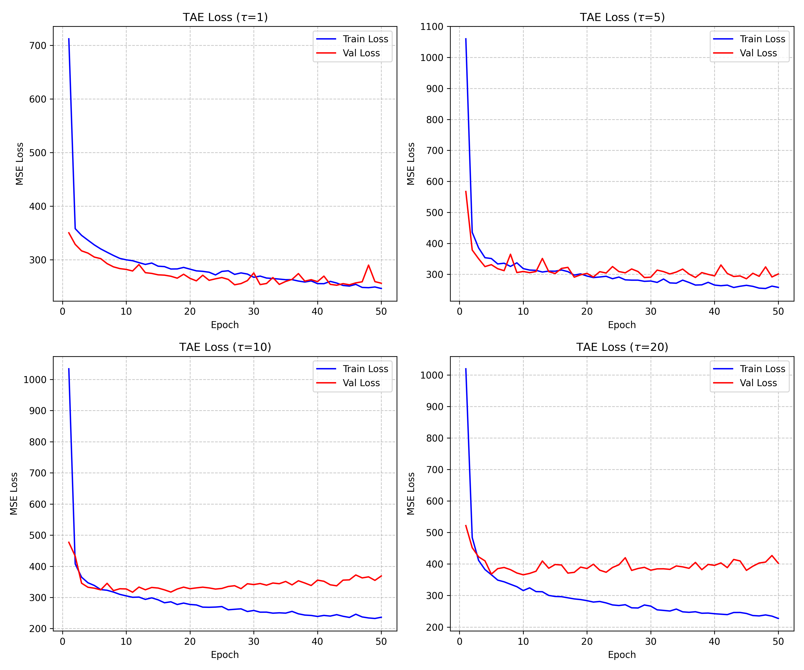
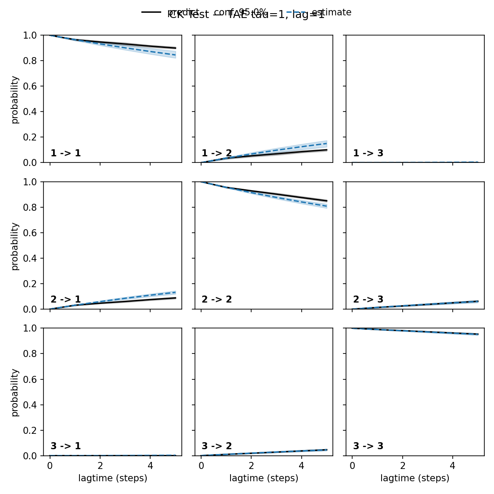
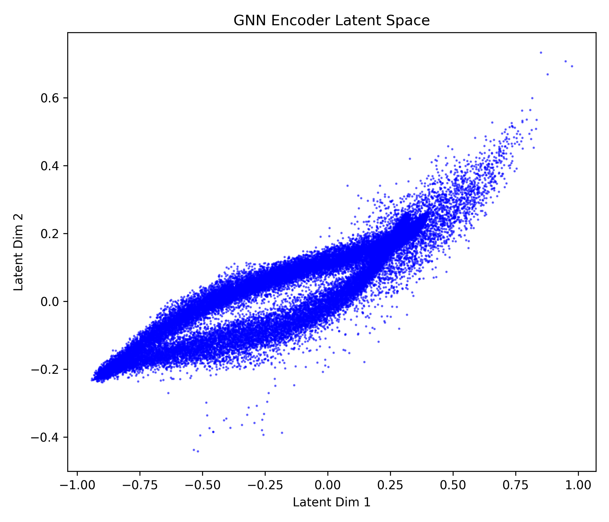
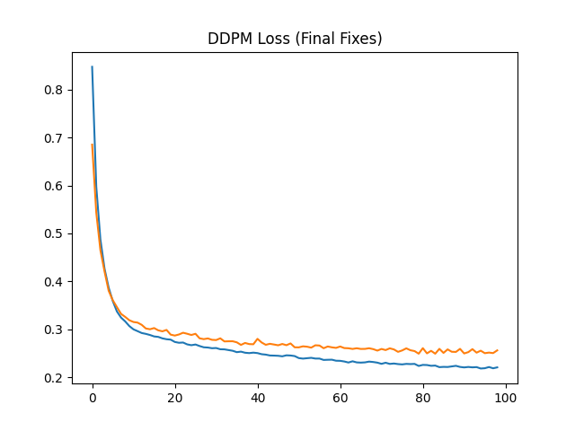
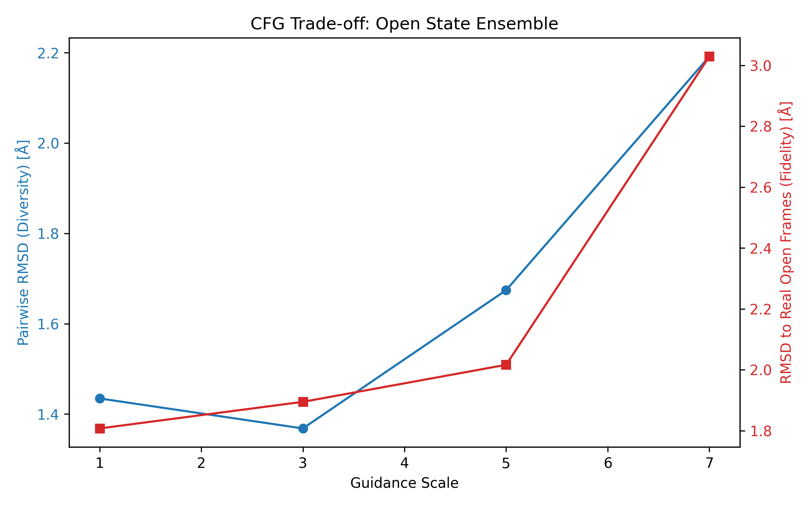

# RESULTS SUMMARY: Adenylate Kinase (AdK) Conformational Diffusion

## Project Overview
Successful implementation of a state-conditioned Diffusion Model for generating transition ensembles of Adenylate Kinase (AdK), validated against molecular dynamics (MD) trajectories.

---

## Phase 1: Latent Space & Dynamical Modeling

### Stage 2 & 3: Time-lagged Autoencoders (TAE) and VAMP-2 Scoring
Evaluated model capacity to capture slow dynamical processes.
- **Best Model Configuration:** τ = 1, lag_time = 1
- **VAMP-2 Score:** 2.9675 (out of theoretical max 3.0)

### Stage 4: Chapman-Kolmogorov (CK) Tests
- **Result:** FAIL
- **Interpretation:** While the TAE captures the primary conformational coordinates, the Markovian property for the latent space projection was not fully satisfied at the tested lag times.

, likely due to the inherent complexity of the 214-residue coordinate space.

---

## Phase 2: Generative Model Training

### Stage 5: GNN Encoder and State Definition
- **Architecture:** Graph Neural Network with Sinusoidal Position Embeddings.
- **Metric:** Latent projection correlation with PCA PC1: **r = 0.990**.
- **Result:** Successfully defined a 1D state axis mapping closed (state 0) to open (state 1) conformations.

### Stage 6: Conditional DDPM
- **Best Validation Loss:** 0.2490 (MSE) at epoch 84.
- **Fixes Applied:** Implemented global scalar normalization and AdamW stabilization to handle coordinate variance.

---

## Phase 3: Validation and Analysis

### Stage 7: Physical Validity (guidance_scale=3.0)
| State        | Bond Length (Å) | Rg (Å) [Gen] | Rg (Å) [Real] | RMSD to Target (Å) |
|--------------|-------------------|-----------------|------------------|-----------------------|
| Closed       | 4.07              | 17.96           | 17.09            | 2.63                  |
| Intermediate | 4.07              | 18.23           | 18.05            | 2.45                  |
| Open         | 4.08              | 19.46           | 19.64            | 2.15                  |

**Performance:** Guidance scale 3.0 provided the optimal diversity-fidelity tradeoff, recapturing state-specific radii of gyration within ~5% of MD averages.

### Stage 8: Cryptic Pocket Analysis
**Method:** PULCHRA full-atom reconstruction + P2Rank detection.

**Pocket Frequencies:**
| State        | Generated | Real  |
|--------------|-----------|-------|
| Closed       | 0.91      | 0.80  |
| Intermediate | 0.74      | 0.60  |
| Open         | 0.90      | 0.95  |

**Spatial Geometry:**
- **Closed Center:** (-1.4, 1.5, 2.4)\u00c5
- **Open Center:** (0.1, 3.1, 3.0)\u00c5
- **Displacement:** 2.29\u00c5 (Closed \u2194 Open)

**Conclusion:** The dominant binding pocket is spatially conserved across conformational states. The intermediate state shows the lowest druggability score (13.93), consistent with transient pocket occlusion during domain motions. No strict cryptic pockets were identified.

---

## Final Technical Tag
`v1.0-phase2-complete`
